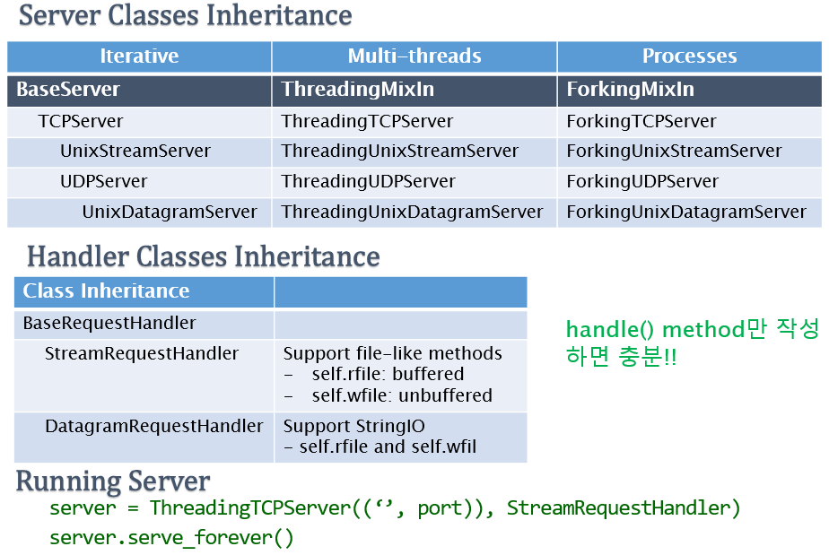

# Nework Programming, Part 3: Servers

## Server가 가져야 할 특성
### Do not stop:
서버는 중단없이 무한히 돌아가야 한다. Exception이 발생했을 때 복구 가능하거나 무시할 수 있는 것이라면 적절히 exception handling하여 계속 실행되도록 한다.
(서버가 돌아가다가 죽으면 안된다.)

### Hanle multiple clients:
동시에 여러 client를 서비스해야 한다. 
Client 마다 connected socket이 탄생하고, 이를 통해 client와 통신한다.

따라서, 서버는 listening socket(새로운 client 소켓을 받는다.) 1개, client와 연결된 connected socket n개를 처리해야 한다. 이를 위해 다음과 같은 approach가 있다.
   1. I/O multiplexing 이용: n+1개의 socket에 대해 readable(데이터 도착했는지) event가 발생했는지 확인하고, 발생된 socket들에 대해 처리. 보통 non-blocking mode의 socket을 처리.(blocking도 된긴된다.)
   (connetion에서 들어오는 것들을 n+1개를 다중화시키는 것이다.)
   1. Multi-threading 이용: main thread는 listening socket으로 `accept`(ready면 accept 가능) 처리, connected socket 마다 동일한 function(or method)를 실행시키는 n개의 thread (커넥션마다 thread를 만든다.)(n+1개 thread 돌아간다.)
   1. Concurrent process 이용: `fork`(같은 코드를 여러개를 돌아갈 수 있다.)(data 부분은 프로세스간에 따로 가지고 있다 thread가 오버헤드가 적다.)
   (서버프로세스가 fork를 만들 수이다.)
   1. multiprossing module 이용: multi core 능력을 이용하려면 
(thread는 운영체제가 돌려주는 것이다.)(멀티코어 cpu가 여러개 있는거)
(멀티스레딩을 하더라고 코어를 하나만 쓸 수 있다. 그래서 멀티코어 능력을 다 활용하지 못한다. 하짐나 멀티프로세싱은 아니다.)(멀티스레딩과 코드는 비슷하다.)

### No associated terminal users:
서버는 보통 컴퓨터가 booting할 때 서버 process가 daemon process(프린트할 터미널이 없다.)로 실행된다. (터미널이 없다. 대신 콘솔이 있다.)
Daemon process라 함은 그 컴퓨터의 user가 없고 terminal도 없다. stdout으로 print 불가능하다. 그러므로, 실행 중 기록을 통상 log 파일에 남기고 and/or 운영자 console로 출력한다. --> `logging` module 사용

참고:
- [logging HOWTO](https://docs.python.org/ko/3/howto/logging.html)
- [selectors — I/O Multiplexing Abstractions](https://pymotw.com/3/selectors/)
- [threading — Manage Concurrent Operations Within a Process](https://pymotw.com/3/threading/index.html)

## I/O Multiplexing server
Socket들을 non-blocking mode로 동작하도록 한다. `accept/send/recv`등 blocked 될 수 있는 operation에 대해서 block되지 않는다. 

I/O multiplexing 대상이 되는 socket과 event 유형(readable/writeable)은 `register` method로 등록한다. `data`를 등록하면 event가 발생했을 때 등록한 data가 무엇이지 access 가능하다. 보통 call-back 함수를 등록한다.
```Python
sel.register(fileobj, events, data=send_recv)
# 관심있는 이벤트는 등록, 데이터는 아무것나 싣을 수 있다.
```

Event 유형는 두 가지로 bit로 표현된다: `selectors.EVENT_READ`, `selectors.EVENT_WRITE`. Bitwise AND(`&`), OR(`|`) operation으로 기술하거나 check할 수 있다.(read, write를 동시에 쓸 수도 있다.)

Multiplexing할 socket들 중 어느 하나 또는 그 이상의 socket에서 event가 발생할 수 있다. 여러 socket(또는 file descriptor)에 대해 동시에 readable한지, writable한지를 `select` 함수로 check할 수 있다. 
```Python
events = sel.select(timeout=None)   # wait for events 이벤트가 발생 할 때까지 blocked 되는 것 (n+1에서 1개라도 레디가 되면 실행한다.)(timeout 주면 0.5면 아무것도 없지만 주기적으로 깨어나는 것)
```

`select`가 return하는 events는 (key, mask) tuple들의 list이다. 그 이전에 timeout이 발생했다면 empty list.(key를 통해 access 할 수 있다.)
발생한 event의 종류는 bit mask로 표현된다. 
key의 attribute들(`fileobj`, `events`, `data`)에서 `register`한 파라미터들을 access할 수 있다.(key.events 이렇게 access를 할 수 있다.)(이게 n+1개 등록된다.)

### servers/server_select.py
`register` method의 parameter `data`에 function을 패스함으로써 event가 발생하면 부를 call-back function을 등록한 것이다. listening socket에 대해서는 `accept`, connected socket에 대해서는 수신한 데이터를 그대로 회신하는 `echo` 함수를 정의했다.

## Multi-threading server
Client와 connection이 성립되면 이 client와의 데이터 교환을 책임질 function을 target으로 하는 thread를 start시킨다. 

```Python
while True:
    conn, cli_addr = sock.accept()  # wait for next client connect
    handler = threading.Thread(target=echo_handler, args=(conn, cli_addr)) #echo handler에서 thread로 돌아간다.
    handler.start()
```

> `threading.Thread`는 class instance(object)만 생성하고 실제 thread는 `start` method로 생성되고 시작된다. 이 thread context에서 `echo_handler(args)`가 call된다.

### servers/server_thread.py:
`echo_server` function은 listening socket으로 client의 connection을 accept하고, 
connected socket을 통한 데이터 송수신을 전담할 thread를 start시킨다.

`echo_handler` function은 echo service를 제공하는 code를 implement한다. 
Echo service는 수신한 bytes를 그대로 돌려주면 되기 때문에 메시지가 무엇이지, 어떤 encoding을 했느지 등
내용을 해석할 필요가 없다.

> 사용중인 port를 `bind`하면 *Address in use* error가 발생한다. 
그럼에도 불구하고 가로채기를 하려면 socket에 option을 다음과 같이 설정한다.
```Python
sock.setsockopt(socket.SOL_SOCKET, socket.SO_REUSEADDR, 1)
```

### servers/server.py: subclassing 가능한 code
보통 server는 listening socket으로 client의 connection 요구를 accept하고, thread를 생성하여 새로운 connected socket를 service handler에게 넘겨주기까지 동일한 일을 수행한다. `ThreadingTCPServer` class가 server들의 공통된 작업을 수행하게 coding되어 있다.

실제 client에게 제공할 서비스가 다른 부분은 별도의 handler를 작성하기만 하면 된다.  
서비스 handler도 공통되는 부분을 `RequestHandler`라는 abstract class로 
작성되어 있다. Class object 생성될 때, setup, handle, finish까지 모두 수행된다.

`EchoRequestHandler`는 `RequestHandler`에서 상속받아 
`handle` method만 구현하면 끝난다. 다른 서비스도 동일한 방법으로 구현 가능하다.
```Python
import server   # server.py
class NewRequestHandler(RequestHandler):
    def handle(self):
        # code here ...

server = ThreadingTCPServer(('', port), NewRequestHandler)
server.serve_forever()        
```
(간단한 방법이다.)
`handle` method는 connection이 완료된 후부터 connection을 해지하기 전까지의 connection ESTABLISH 상태에서 server가 서비스할 code만 삽입하면 충분하다. exception handleing도 특별한 경우 제외하고 필요없다. 

이 코드는 socketserver 모듈의 내부 구조와 사용법을 이해하기 쉽도록 구현해본 것이다. 사실, 재사용성을 높이기 위해 다단계로 상속하고, 
super class가 둘이 되면 소스코드를 이해하기 난해할 것이다. 이 코드를 이용했다면, 
socketserver 모듈을 이용할 준비가 되었다. 

참고: socketserver 모듈을 이용하기 곤란하거나 새로 coding해야 할 일이 많다면, 내가 제공한 소스 파일에서 시작하는 편이 나을 것이다.

### clients/server_socketserver.py:
Python standard library에 socketserver 모듈이 있다. 전술한 server.py에서 보는 바와 같이 inheritance와 overloading을 통해 아래 사항을 조합하여 server를 쉽게 만들 수 있다.
- Transport protocol: TCP socket, UDP socket, UNIX doamin socket을 이용하는 server 종류 
- Concurrent control: I/O multiplixing, threading, forking(concurrent processing) 기법
- Request handler 유형: Stream(makefile에 의해 변환된)을 사용 or 그냥 send/recv를 사용

```
+------------+
| BaseServer |
+------------+
      |
      v
+-----------+        +------------------+
| TCPServer |------->| UnixStreamServer |
+-----------+        +------------------+
      |
      v
+-----------+        +--------------------+
| UDPServer |------->| UnixDatagramServer |
+-----------+        +--------------------+
```


(위에서 밑으로 상속받는 거)
### HTTP Server using standard modules
```Python
import http.server
import socketserver

PORT = 8000

Handler = http.server.SimpleHTTPRequestHandler

with socketserver.TCPServer(("", PORT), Handler) as httpd:
    print("serving at port", PORT) #똑같은 포트를 또 bilding하면 한동안 저거를 계속 돌리고 있어서 사용을 못한다. (TCP 프로토콜 때문이다.)
    httpd.serve_forever()
```

Or,
```bash
python -m http.server 8000 #http 서버 -m 라이브러리 모듈들을 부를떄
```

```bash
python -m http.server --directory /tmp/

```
